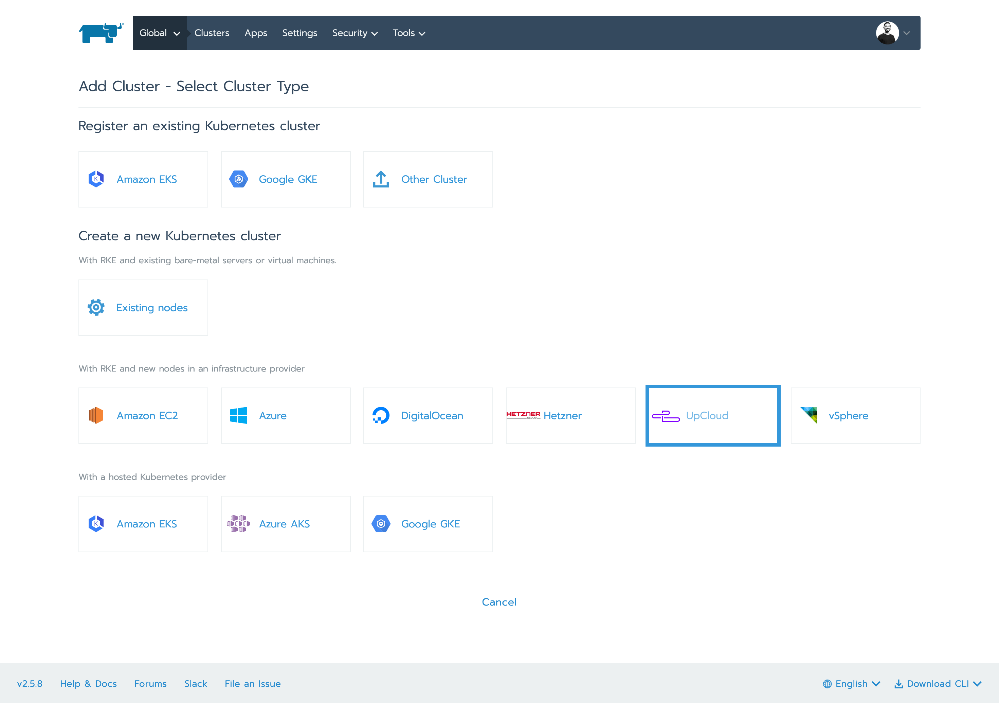
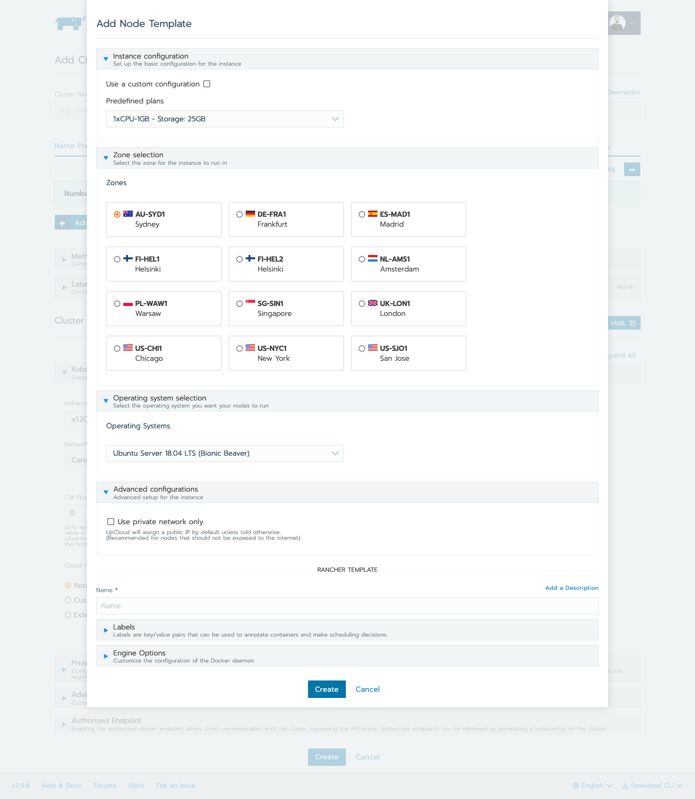

# UpCloud Rancher UI Driver

Rancher UI driver for [UpCloud](https://upcloud.com)

## Using
### Set up the driver
This driver is meant to be used with the [docker-machine-driver-upcloud](https://github.com/montel-ig/docker-machine-driver-upcloud/).

On your Rancher cluster, go to `https://your-cluster.com/n/drivers/node`, and select `Add Node Driver`.

| Driver | Link                                                                                                      |
| ------ |-----------------------------------------------------------------------------------------------------------|
| Download URL | `https://upcloud-rancher-driver.s3.eu-north-1.amazonaws.com/machine/v1.2.1/docker-machine-driver-upcloud` |
| Custom UI URL | `https://upcloud-rancher-driver.s3.eu-north-1.amazonaws.com/ui/v1.2.0/component.js`                       |
| Whitelist Domains | `upcloud-rancher-driver.s3.eu-north-1.amazonaws.com`                                                      |

Press `Create` and wait for the Rancher node to download the `docker-machine` driver. Once that's done, you should see the driver status as `Active`. Then you're good to go.

### Create a cluster
On the Global cluster page, click `Add Cluster` and Select `UpCloud`

Under the `Node Pools` section, create a new node template. This will prompt you to authenticate your UpCloud user. Neither we nor Rancher store any of this information, this is used only for the interactions with the API.

After you authenticate yourself, select the configuration for the instance. It can be either a predefined plan or a custom configuration.

Then, proceed to select the region for the nodes to run in.
You can also select a custom operating system (note: the operating system you choose might not be supported by Docker Machine to run or it might require extra setup that is not handled by Rancher).

Once you're done with this, specify a name for the node template and you're good to go! :raised_hands:

## Development

This package contains a small web-server that will serve up the custom driver UI at `http://localhost:3000/component.js`.  You can run this while developing and point the Rancher settings there.
* `npm start`
* The driver name can be optionally overridden: `npm start -- --name=DRIVERNAME`
* The compiled files are viewable at http://localhost:3000.
  * To be accessible to a live Rancher cluster, use a tunnel to `localhost`, like `ngrok` or `localtunnel`.
* Do not use the `model.<drivername>Confg` signature to access your driver config in the template file, use the `config` alias that is already setup in the component

## Building

For other users to see your driver, you need to build it and host the output on a server accessible from their browsers.

* `npm run build`
* Copy the contents of the `dist` directory onto a webserver.
  * If your Rancher is configured to use HA or SSL, the server must also be available via HTTPS.

